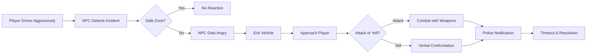

# 🚗💥 JM-NPCRoadRage - Advanced FiveM Road Rage System

<div align="center">

[](https://fivem.net/)
[](https://github.com/qbcore-framework)
[](LICENSE)
[](#changelog)
[](https://github.com/jmmodifications/jm-npcroadvage/releases)
[](https://github.com/jmmodifications/jm-npcroadvage/stargazers)

**Transform your FiveM server with realistic NPC road rage interactions**

*Bring authentic street-level aggression and unpredictable encounters to your roleplay experience*

[🚀 **Quick Start**](#-quick-installation) • [📖 **Documentation**](#-documentation) • [⚙️ **Features**](#-key-features) • [💬 **Support**](#-support--community)


</div>

---

## 🚀 **Key Features**

<table>
<tr>
<td width="50%">

### 🎮 **Immersive Gameplay**
- **Dynamic NPC Reactions** - Contextual responses to player actions
- **Multi-Phase Escalation** - From anger to confrontation to combat
- **Realistic Audio** - Authentic rage sounds and speech
- **Smart Animations** - Lifelike gestures and movements

### 🛡️ **Safety & Balance**
- **Protected Safe Zones** - Hospitals, police stations stay peaceful
- **Weapon Blacklist** - Block overpowered weapons (RPGs, explosives)
- **Health-Based Injuries** - Only trigger when real damage occurs
- **Configurable Intensity** - Adjust aggression to server preference

</td>
<td width="50%">

### 🔧 **Server Integration**
- **QBCore Police** - Automatic 911 calls and dispatch
- **Ambulance System** - Realistic injury and medical response
- **Discord Logging** - Advanced webhook integration with spam protection
- **Performance Monitoring** - Built-in optimization and cleanup

### 👨‍💼 **Admin Controls**
- **Testing Commands** - Trigger events for demonstration
- **Troll Cop System** - ⚠️ Spawn aggressive cops for entertainment/testing
- **Real-time Statistics** - Monitor system performance
- **Hot Configuration** - Update settings without restart
- **Debug Tools** - Comprehensive troubleshooting

</td>
</tr>
</table>

---

## 🚀 **Quick Installation**

### **Prerequisites** (Takes 2 minutes)
- ✅ QBCore Framework
- ✅ qb-policejob  
- ✅ qb-ambulancejob

### **Installation** (Takes 3 minutes)

```bash
# 1. Download and extract to resources folder
Purchase the script from https://jm-modifications.tebex.io/ then download it from your CFX Portal Granted assets at https://portal.cfx.re/assets/granted-assets

# 2. Add to server.cfg
echo "ensure JM-NPCRoadRage" >> server.cfg

# 3. Restart your server
# You're done! 🎉
```

> 📋 **[Complete Installation Guide](INSTALL.md)** - Detailed setup with screenshots and troubleshooting

---

## 📖 **Documentation**

### 🎮 **Admin Commands**

| Command | Description | Example |
|---------|-------------|---------|
| `/testrage` | Trigger road rage for testing | Test with nearby NPC |
| `/clearrage` | Clear all active road rage NPCs | Stop all current incidents |
| `/npcrage-stats` | View system statistics | Monitor performance |
| `/weaponinfo` | Show weapon configuration | Check blacklist status |
| `/trollcops` | **🚨 Trigger troll cops (Admin Only)** | Spawn aggressive cops in jurisdiction |
| `/cleartrollcops` | **🚨 Clear all troll cops** | Remove all spawned troll cops |
| `/trollcopinfo` | **🚨 Show troll cop status** | View jurisdiction and cooldown info |

> ⚠️ **Warning**: Troll cop commands are powerful admin tools. Use responsibly for entertainment or testing purposes only.

### ⚙️ **Quick Configuration**

```lua
-- Basic Settings (config.lua)
Config.RoadRageChance = 15        -- 15% trigger chance
Config.AttackChance = 70          -- 70% will attack vs yell  
Config.WeaponChance = 40          -- 40% will use weapons
Config.MaxRageNPCs = 5            -- Max 5 concurrent NPCs

-- Safety Settings
Config.BlacklistedAreas = {
    {x = -545.0, y = -204.0, z = 38.0, radius = 100.0}, -- Hospital
    -- Add your safe zones
}

Config.BlacklistedWeapons = {
    'WEAPON_RPG',               -- No RPGs
    'WEAPON_STICKYBOMB',        -- No explosives
    -- Add dangerous weapons to block
}
```

### 🔗 **Discord Integration** (Optional)

```lua
Config.Discord = {
    enabled = true,
    webhook = "YOUR_WEBHOOK_URL",
    spamPrevention = {
        enabled = true,
        cooldownTime = 60000,      -- 1 minute cooldown
        maxLogsPerMinute = 5       -- Rate limiting
    }
}
```

---

## 🎯 **How It Works**

<div align="center">



</div>

### 📊 **System Mechanics**

1. **🔍 Detection** - Monitors collisions and aggressive driving patterns
2. **🎲 Decision** - NPCs make contextual choices based on configuration
3. **⚡ Escalation** - Multi-phase response from verbal to physical
4. **🚨 Integration** - Automatic police and medical system alerts
5. **🔄 Resolution** - Smart cleanup and timeout management

---

## 📈 **Performance & Compatibility**

<div align="center">

| Metric | Value | Status |
|--------|-------|--------|
| **CPU Impact** | < 0.01ms/tick | 🟢 Excellent |
| **Memory Usage** | ~2MB | 🟢 Minimal |
| **Network Traffic** | Event-driven | 🟢 Optimized |
| **Player Count** | Unlimited | 🟢 Scalable |

</div>

### ✅ **Tested Environments**
- **QBCore** v1.0+ (Primary)
- **OneSync Infinity** (Recommended)
- **Windows/Linux** Servers
- **High Population** Servers (200+ players)

---

## 🛠️ **Advanced Configuration**

<details>
<summary><strong>🔧 Weapon System Configuration</strong></summary>

```lua
-- Allowed Weapons (NPCs can use these)
Config.RageWeapons = {
    'WEAPON_KNIFE',
    'WEAPON_BAT',
    'WEAPON_PISTOL',
    -- Add more weapons
}

-- Blacklisted Weapons (NPCs will never use these)
Config.BlacklistedWeapons = {
    'WEAPON_RPG',
    'WEAPON_MINIGUN',
    'WEAPON_STICKYBOMB',
    -- Block dangerous weapons
}
```
</details>

<details>
<summary><strong>🚨 Troll Cop System (Admin Feature)</strong></summary>

```lua
-- Troll Cop Configuration (ADMIN ONLY - FOR TESTING/ENTERTAINMENT)
Config.TrollCops = {
    enabled = false,                -- Enable/disable system
    triggerChance = 5,             -- 5% chance to trigger automatically
    
    -- Define jurisdictions where troll cops can spawn
    jurisdictions = {
        {
            name = "Sandy Shores Sheriff",
            coords = {x = 1853.0, y = 3686.0, z = 34.0},
            radius = 500.0,
            enabled = true
        },
        {
            name = "Paleto Bay Police", 
            coords = {x = -448.0, y = 6008.0, z = 31.0},
            radius = 400.0,
            enabled = true
        }
    },
    
    -- Behavior settings
    copCount = {min = 2, max = 4},     -- Number of cops to spawn
    weapons = {                        -- Weapons they use
        'WEAPON_PISTOL',
        'WEAPON_SMG',
        'WEAPON_CARBINERIFLE'
    },
    shootDuration = 15000,             -- 15 seconds of shooting
    cooldown = 300000,                 -- 5 minute cooldown
    maxPerSession = 3,                 -- Max 3 events per session
    
    -- Admin controls
    adminOnly = true,                  -- Only admins can trigger manually
    logToDiscord = true,               -- Log events to Discord
    warningMessage = "⚠️ TROLL COPS INCOMING! ⚠️"
}
```

> ⚠️ **Important**: This is a powerful admin feature designed for entertainment/testing. Use responsibly and ensure players understand it's for fun. Can be disabled entirely by setting `enabled = false`.

**Admin Commands:**
- `/trollcops` - Manually trigger in current jurisdiction
- `/cleartrollcops` - Remove all active troll cops  
- `/trollcopinfo` - View status and jurisdictions

</details>

<details>
<summary><strong>🏥 Health & Injury System</strong></summary>

```lua
-- Injury Configuration
Config.InjuryChance = 30          -- 30% chance when hit
-- Health-based detection (v1.0+)
-- Only triggers when player actually loses health
-- Integrates with qb-ambulancejob automatically
```
</details>

<details>
<summary><strong>🚨 Police Integration</strong></summary>

```lua
-- Police Settings
Config.PoliceNotifyChance = 80    -- 80% notification rate
Config.MinPoliceOnline = 2        -- Minimum officers required
Config.PoliceJob = 'police'       -- Job name in QBCore
Config.PoliceResponseTime = 120000 -- 2 minute response
```
</details>

<details>
<summary><strong>📊 Discord Logging</strong></summary>

```lua
-- Advanced Discord Features
Config.Discord = {
    enabled = true,
    webhook = "YOUR_WEBHOOK_URL",
    
    -- Anti-Spam System
    spamPrevention = {
        enabled = true,
        cooldownTime = 60000,
        maxLogsPerMinute = 5,
        combineIncidents = true,
        
        -- Quiet Hours
        quietHours = {
            enabled = true,
            startHour = 2,        -- 2 AM
            endHour = 8,          -- 8 AM
        }
    },
    
    -- Event Types
    logEvents = {
        roadRageIncidents = true,
        policeNotifications = true,
        playerInjuries = true,
        adminActions = true
    }
}
```
</details>

---

## 🔍 **Troubleshooting**

### ❓ **Common Questions**

<details>
<summary><strong>🚫 NPCs not reacting to collisions?</strong></summary>

**Quick Fixes:**
1. Check if you're in a safe zone (hospital, police station)
2. Increase `Config.RoadRageChance` for testing
3. Use `/testrage` command to manually trigger
4. Verify `Config.MaxRageNPCs` limit not reached

**Debug:**
```cfg
# Enable debug mode in server.cfg
setr jm_npcrage_debug "true"
```
</details>

<details>
<summary><strong>🏥 Injury system not working?</strong></summary>

**Status:** ✅ **Enhanced in v1.0**
- New health-based detection system
- Only triggers when player actually takes damage
- Integrates automatically with qb-ambulancejob

**Verify:**
1. qb-ambulancejob is installed and running
2. Player actually lost health during combat
3. Check `Config.InjuryChance` setting
</details>

<details>
<summary><strong>👮 Police not being notified?</strong></summary>

**Common Causes:**
- Not enough police online (check `Config.MinPoliceOnline`)
- Police job name mismatch (verify `Config.PoliceJob`)
- qb-policejob not running properly

**Solution:**
Use `/npcrage-stats` to check police count and system status
</details>

---

## 📚 **Additional Resources**

### 📖 **Documentation**
- 📋 **[Installation Guide](INSTALL.md)** - Complete setup instructions
- ⚙️ **[Configuration Reference](CONFIG.md)** - All settings explained  
- 🔗 **[Discord Setup Guide](DISCORD_SETUP.md)** - Webhook configuration
- 🔧 **[API Documentation](docs/API.md)** - Developer integration

### 🎥 **Video Guides**
- 🚀 **Installation Tutorial** - Step-by-step setup
- ⚙️ **Configuration Walkthrough** - Customize your experience  
- 🎮 **Demonstration** - See the system in action

---

## 🔄 **Changelog**

### 🎉 **v1.0.0** - *October 31, 2025* - **Initial Public Release**

#### ✨ **Core Features**
- **Dynamic Road Rage System** - Intelligent NPC reactions to player driving
- **QBCore Integration** - Seamless police and ambulance system connection
- **Health-Based Injuries** - Realistic damage detection and medical consequences
- **Weapon Management** - Configurable weapons with safety blacklist
- **Discord Integration** - Advanced logging with spam prevention

#### 🛡️ **Safety Features**  
- **Protected Safe Zones** - Hospitals, police stations, airports
- **Weapon Blacklist** - Block dangerous weapons (RPGs, explosives, etc.)
- **Performance Optimization** - Efficient detection and cleanup systems
- **Anti-Spam System** - Intelligent Discord logging with cooldowns

#### 🔧 **Admin Tools**
- **Testing Commands** - `/testrage`, `/clearrage`, `/npcrage-stats`
- **Weapon Management** - `/weaponinfo`, `/reloadweapons`  
- **Debug System** - Comprehensive logging and troubleshooting
- **Hot Configuration** - Update settings without restart

#### 🎨 **Immersion Features**
- **Realistic Audio** - Authentic NPC rage sounds and speech
- **Dynamic Animations** - Lifelike gestures and movements
- **Multi-Phase Escalation** - From anger to confrontation to combat
- **Context-Aware Behavior** - NPCs react appropriately to situations

---

## 🤝 **Support & Community**

<div align="center">

### 🌟 **Join Our Community**

[](https://discord.gg/jmmodifications)
[](https://github.com/jmmodifications/jm-npcroadvage)

**Get Help • Share Feedback • Request Features • Showcase Your Server**

</div>

### 📞 **Support Channels**

| Platform | Best For | Response Time |
|----------|----------|---------------|
| 💬 **[Discord Server](https://discord.gg/jmmodifications)** | General help, community | < 6 hours |
| 🐛 **[GitHub Issues](https://github.com/jmmodifications/jm-npcroadvage/issues)** | Bug reports, feature requests | < 24 hours |
| 📧 **support@jmmodifications.com** | Private support, business inquiries | < 48 hours |

### 🤝 **Contributing**

We welcome community contributions! Here's how you can help:

- 🐛 **Report Bugs** - Help us improve by reporting issues
- 💡 **Suggest Features** - Share ideas for new functionality  

---

## 🛡️ Escrowed Protected by CFX 🛡️
- This resource is escrowed protected by CFX.

## 📄 **License & Terms**

### 📜 **Custom License**
This project is licensed under the **JM Modifications License**

### ✅ **Usage Rights**
- ✅ **Free for FiveM Servers** - Use on any server without licensing fees
- ✅ **Modification Allowed** - Customize and adapt to your needs

### ❌ **Restrictions**
- ❌ **No Resale** - Cannot be sold as a standalone product
- ❌ **No Warranty** - Provided as-is without guarantees
- 📝 **Attribution Required** - Credit JM Modifications in your server
- ❌ **No Commercial Use** - Not allowed to Use on commercial FiveM servers
- ❌ **Claiming this resource** - Not allowed to claim this resource as your own

---

<div align="center">

## 🌟 **Ready to Transform Your Server?**

### **[💲Purchase Now](https://github.com/jmmodifications/jm-npcroadvage/releases/latest) • [📖 Read Docs](INSTALL.md) • [💬 Get Support](https://discord.gg/jmmodifications)**

---

### 💖 **If this script enhanced your server experience, please consider:**
⭐ **[Starring the repository](https://github.com/jmmodifications/jm-npcroadvage/stargazers)**  
💬 **[Joining our Discord community](https://discord.gg/jmmodifications)**  
📝 **[Sharing feedback and suggestions](https://github.com/jmmodifications/jm-npcroadvage/discussions)**

---

**Created with ❤️ by [JM Modifications](https://jmmodifications.com)**  
*Professional FiveM Development • Custom Scripts • Server Optimization*

**© 2025 JM Modifications. Released under MIT License.**

[⬆️ Back to Top](#-jm-npcroadvage---advanced-fivem-road-rage-system)
